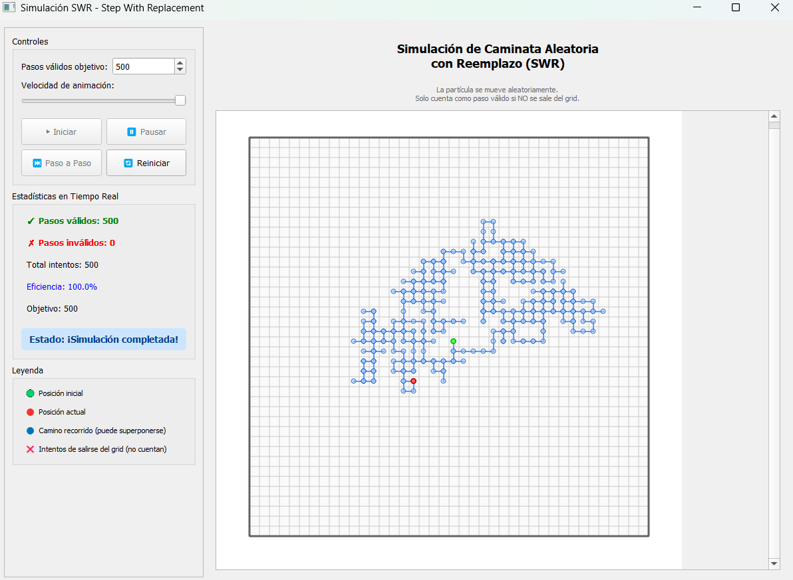
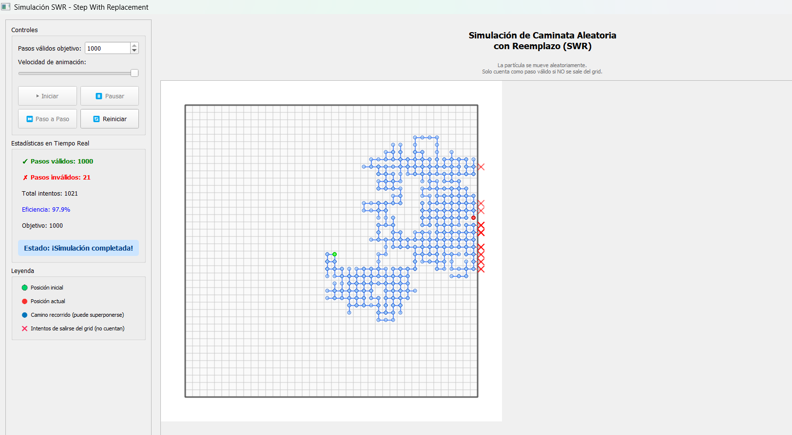

# Simulación SWR (Step With Replacement)

Proyecto de simulación de caminata aleatoria con reemplazo con interfaz gráfica en PyQt5.

## 📁 Estructura del Proyecto

```
proyecto_swr/
│
├── main.py                 # Punto de entrada principal
│
├── models/                 # Modelos de la simulación
│   ├── __init__.py
│   ├── particle.py        # Clase Particle
│   └── simulator.py       # Clase Simulator
│
├── gui/                    # Interfaz gráfica
│   ├── __init__.py
│   ├── main_window.py     # Ventana principal
│   └── canvas.py          # Lienzo de visualización
│
└── README.md              # Este archivo
```

## 🔧 Requisitos

- Python 3.7 o superior
- PyQt5

## 📦 Instalación

1. Instala PyQt5:
```bash
pip install PyQt5
```

## 🚀 Ejecución

Desde la carpeta raíz del proyecto, ejecuta:

```bash
python main.py
```

## 📖 Descripción del Proyecto

### ¿Qué es SWR (Step With Replacement)?

Es una caminata aleatoria donde:
- La partícula se mueve **aleatoriamente** en 4 direcciones (arriba, abajo, izquierda, derecha)
- **PUEDE revisitar** la misma posición múltiples veces (con reemplazo)
- Un paso **SOLO cuenta como válido** si NO se sale del grid
- Si intenta salirse, ese intento **NO cuenta** como paso válido

### Diferencia con SAW (Self-Avoiding Walk)

| Característica | SWR | SAW |
|---|---|---|
| Puede revisitar posiciones | ✅ Sí | ❌ No |
| Se cuenta el paso si revisita | ✅ Sí (si está en el grid) | ❌ No puede |
| Puede quedar atrapada | ❌ No | ✅ Sí |
| Validación | Solo los bordes | Bordes + historial |

### Componentes Principales

#### 1. **Particle (models/particle.py)**
Representa la partícula que se mueve por el grid.
- Mantiene su posición actual
- Guarda el historial de posiciones visitadas (para visualización)
- Genera movimientos aleatorios en 4 direcciones
- Valida que no se salga del grid
- **Cuenta pasos válidos e inválidos por separado**

#### 2. **Simulator (models/simulator.py)**
Gestiona la lógica de la simulación.
- Controla el número de pasos **válidos** máximos
- Ejecuta pasos de la simulación con SWR
- Distingue entre pasos válidos e inválidos
- Proporciona estadísticas detalladas

#### 3. **SimulationCanvas (gui/canvas.py)**
Widget de PyQt5 que visualiza la simulación.
- Dibuja el grid
- Muestra el camino recorrido (con transparencia para ver superposiciones)
- Resalta la posición actual de la partícula
- Maneja la animación automática

#### 4. **MainWindow (gui/main_window.py)**
Ventana principal con controles.
- Panel de configuración (pasos válidos objetivo, velocidad)
- Botones de control (iniciar, pausar, paso a paso, reiniciar)
- Panel de estadísticas en tiempo real con eficiencia

## 🎮 Uso de la Aplicación

### Controles

- **Pasos válidos objetivo**: Define cuántos pasos válidos debe dar la partícula
- **Velocidad**: Ajusta la velocidad de la animación
- **Iniciar**: Comienza la simulación automática
- **Pausar**: Pausa la simulación
- **Paso a Paso**: Ejecuta un paso manual (útil para ver intentos inválidos)
- **Reiniciar**: Reinicia la simulación desde cero

### Visualización

- 🟢 **Punto verde**: Posición inicial
- 🔵 **Puntos azules semi-transparentes**: Camino recorrido (se ve más oscuro donde se superpone)
- 🔴 **Punto rojo**: Posición actual de la partícula
- **Líneas azules**: Conexiones del camino

### Estadísticas en Tiempo Real

- **✓ Pasos válidos**: Movimientos exitosos dentro del grid
- **✗ Pasos inválidos**: Intentos de salirse del grid que NO cuentan
- **Total intentos**: Suma de válidos + inválidos
- **Eficiencia**: Porcentaje de pasos válidos respecto al total de intentos
- **Objetivo**: Número de pasos válidos a alcanzar

### Estados de la Simulación

- **Listo**: Simulación lista para comenzar
- **Simulando...**: Simulación en curso
- **Pausado**: Simulación pausada
- **¡Simulación completada!**: La partícula alcanzó el número de pasos válidos objetivo

## 🎯 Reglas de la Simulación (SWR)

1. La partícula inicia en el centro del grid (40x40)
2. En cada iteración, la partícula intenta moverse aleatoriamente a una celda adyacente
3. **Si el movimiento está dentro del grid**: 
   - ✅ Es un **paso VÁLIDO**
   - Se cuenta para el objetivo
   - La partícula se mueve
4. **Si el movimiento sale del grid**:
   - ❌ Es un **paso INVÁLIDO**
   - NO se cuenta para el objetivo
   - La partícula NO se mueve
5. La partícula **PUEDE revisitar** posiciones ya visitadas (con reemplazo)
6. La simulación termina cuando alcanza el número de pasos **válidos** establecido
7. **NUNCA queda atrapada** (siempre puede intentar moverse)


## 🎯Preubas de la Simulación (SWR)

En la simulación de 500 pasos válidos, el recorrido mostrado en el grid es más compacto y presenta una dispersión moderada alrededor de la posición inicial.
A la izquierda se presentan los controles y estadísticas en tiempo real: pasos válidos, inválidos, eficiencia, total de intentos y estado final. En el área central se visualiza el grid con el camino en azul, la posición inicial en verde y la posición actual en rojo.


En la simulación de 850 pasos válidos, la caminata aleatoria muestra una dispersión más amplia y una estructura más extendida en comparación con la prueba de 500 pasos. El patrón presenta ramificaciones más largas y zonas densamente reencontradas, lo que evidencia la naturaleza no restrictiva del SWR, donde se permiten superposiciones.

En esta ejecución se registraron solo 3 pasos inválidos, lo que representa una eficiencia muy alta (99.6%). Esto indica que la partícula permaneció la mayor parte del tiempo lejos de los límites del grid, reduciendo significativamente los intentos fallidos.

El grid central muestra un recorrido más expandido hacia la parte inferior y lateral derecha.


En la simulación de 1000 pasos, aparecen 21 pasos inválidos, señalados en rojo.Esto indica que conforme aumenta el número de pasos válidos, crece también la probabilidad de que la partícula se acerque a los límites y genere más intentos inválidos.A pesar de ello, la eficiencia se mantiene elevada (97.9%), indicando que los intentos fuera del límite fueron pocos en relación con los 1000 pasos válidos obtenidos.


## 📊 Estadísticas y Métricas

### Métricas Principales
- **Pasos válidos**: Movimientos exitosos dentro del grid
- **Pasos inválidos**: Intentos de salirse que no cuentan
- **Total intentos**: Cuántas veces intentó moverse
- **Eficiencia**: `(pasos_válidos / total_intentos) × 100%`

### Eficiencia Típica
- Si la partícula está en el centro: ~100% (4 movimientos válidos de 4)
- Si la partícula está cerca de una pared: ~75% (3 movimientos válidos de 4)
- Si la partícula está en una esquina: ~50% (2 movimientos válidos de 4)

## 🔍 Características Técnicas

- Arquitectura MVC (Model-View-Controller)
- Separación clara de responsabilidades
- Código modular y reutilizable
- Interfaz intuitiva con PyQt5
- Validación completa de movimientos según SWR
- Visualización en tiempo real con transparencias
- Tracking de pasos válidos e inválidos

## 💡 Análisis del Comportamiento

### ¿Por qué SWR es diferente?

Con SWR, la partícula puede explorar libremente todo el grid sin restricciones de historial. Esto significa:

1. **Mayor libertad**: Puede volver a zonas ya exploradas
2. **Nunca queda atrapada**: Siempre tiene movimientos posibles (aunque algunos sean inválidos)
3. **Más iteraciones necesarias**: Especialmente si la partícula se queda cerca de los bordes
4. **Patrones repetitivos**: Puede ver que visita las mismas celdas múltiples veces

### Casos Extremos

- **Partícula en esquina**: 50% de intentos serán inválidos
- **Partícula en borde**: 25% de intentos serán inválidos  
- **Partícula en centro**: ~0% de intentos inválidos (al inicio)

## 🆚 Comparación: SWR vs SAW

```
SWR (Step With Replacement):
- ✅ Puede revisitar posiciones
- ✅ Continúa hasta alcanzar N pasos VÁLIDOS
- ✅ Los intentos de salirse NO cuentan
- ❌ Nunca queda atrapada

SAW (Self-Avoiding Walk):
- ❌ NO puede revisitar posiciones
- ✅ Cada paso válido es único
- ✅ Puede quedar atrapada sin movimientos
- ✅ Caminos más "exploratorios"
```

## 💡 Posibles Extensiones

- Agregar diferentes tamaños de grid configurables
- Visualizar histograma de posiciones visitadas
- Mostrar "mapa de calor" de frecuencias
- Estadísticas avanzadas (distancia euclidiana, desviación estándar)
- Comparación con SAW lado a lado
- Exportar datos a CSV para análisis
- Diferentes distribuciones de probabilidad por dirección

## 👨‍💻 Autor

Luis Armijos
Anthony Gutierrez
Ariana Sarango
Miguel Luna

---

## 📝 Notas Importantes

**Este proyecto implementa SWR (Step With Replacement)**, donde:
- Los pasos válidos son aquellos que permanecen dentro del grid
- Los intentos de salirse NO cuentan como pasos
- La partícula PUEDE revisitar posiciones libremente